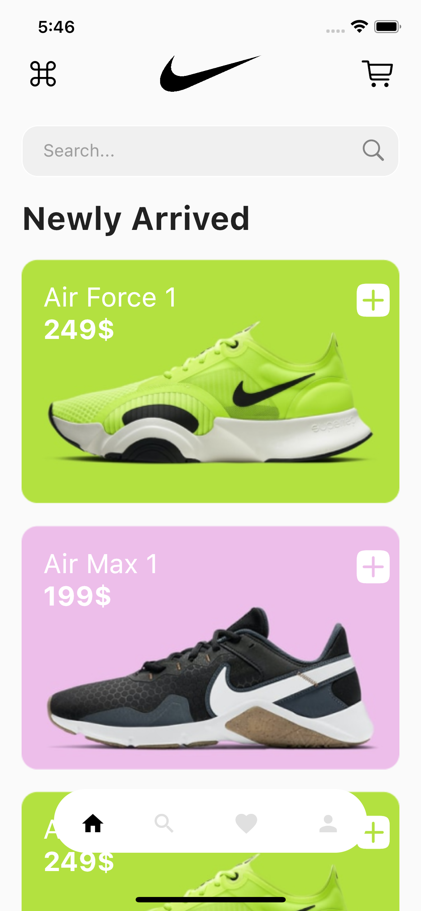
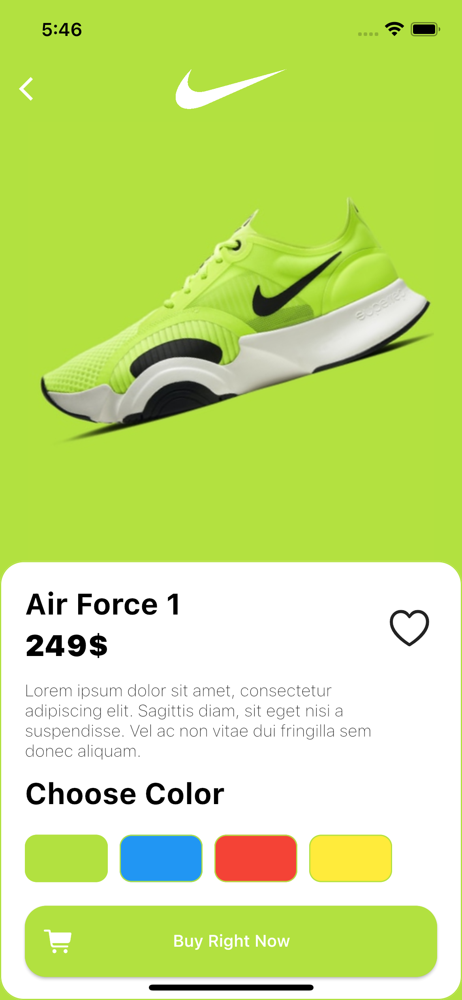
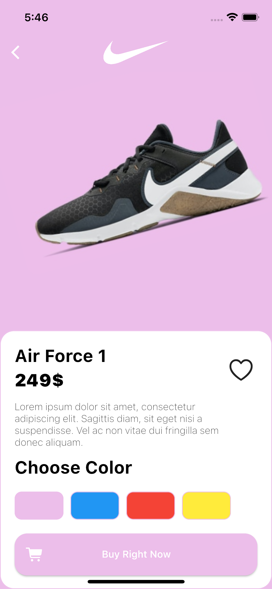

<h1>Flutter Nike Shop App</h1>

<h2>Screens: </h2>



<h2>Usage: </h2>


```bash

git clone https://github.com/universal-developer/flutter_nike_store_app.git

flutter run flutter_nike_store_app

```
